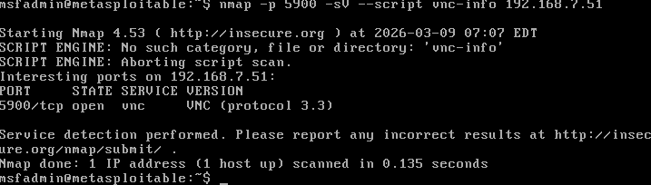

# Arbeitsbericht – VNC Exploitation & portmapper/nfs vulnerability
 
**Name:** Aldin Mukic  
**Datum:** 09.03.2026  
**Fach:** ITSE Labor  
**Klasse:** 4AHITS

**Aufgabe:** 
[VNC Exploitation](https://www.franzmatejka.at/htl/doc/ITSI_4/lab/09_vnc_exploit.html) <br>
[portmapper/nfs vulnerability](https://www.franzmatejka.at/htl/doc/ITSI_4/lab/10_portmapper_nfs.html) <br>


---
 
## Inhaltsverzeichnis

1. [VNC Exploitation](#vnc-exploitation)  
   1.1 [Übung (VNC - Recherche)](#1-übung-vnc---recherche)  
   - [Aufgabenstellung](#aufgabenstellung)  
   - [Lösung](#lösung)  

   1.2 [Übung (VNC - Scan)](#2-übung-vnc---scan)  
   - [Aufgabenstellung](#aufgabenstellung-1)  
   - [Lösung](#lösung-1)  

   1.3 [Übung (VNC - Exploit)](#3-übung-vnc---exploit)  
   - [Aufgabenstellung](#aufgabenstellung-2)  
   - [Lösung](#lösung-2)  

2. [portmapper/nfs vulnerability](#portmappernfs-vulnerability)  
   2.1 [Übung (ssh auf Metasploitable)](#1-übung-ssh-auf-metasploitable)  
   - [Aufgabenstellung](#aufgabenstellung-3)  
   - [Lösung](#lösung-3)  


--- 

Metasploitable IP:  192.168.7.51<br>
Kali Linux IP:      192.168.7.52<br>

# VNC Exploitation

## 1 Übung (VNC - Recherche)

### Aufgabenstellung

Recherchiere Basics zu VNC (Virtual Network Computing).

### Lösung

VNC steht für Virtual Network Computing. Damit kann man einen Computer aus der Ferne steuern. Man sieht den Bildschirm des anderen Rechners und kann ihn mit Maus und Tastatur bedienen, so als würde man direkt davor sitzen.<br>
VNC arbeitet nach dem Client-Server Prinzip. Auf dem Zielcomputer läuft ein VNC-Server, und der Benutzer verbindet sich mit einem VNC-Client. Die Verbindung läuft normalerweise über den Port 5900.<br>
Das Protokoll, das VNC verwendet, heißt RFB (Remote Frame Buffer). Dabei werden die Bildschirminhalte vom Server an den Client geschickt.<br>
VNC wird oft für Remote Administration, Fernwartung oder Zugriff auf Server verwendet. Ein Problem bei VNC ist, dass ältere Versionen schwache oder keine Verschlüsselung haben und dadurch leichter angegriffen werden können.

## 2 Übung( VNC - Scan)

### Aufgabenstellung

Scanne mit nmap den VNC Port auf Metasploitable. Teste Version und Banner. Verwende das nmap Script vnc-info.

### Lösung

Zuerst habe ich mit **nmap** überprüft, ob auf der Metasploitable Maschine ein **VNC Server** läuft. Der Standardport für VNC ist **5900**.
Befehl:

```bash
nmap -p 5900 -sV --script vnc-info 192.168.7.51
```

**Erklärung:**

- `-p 5900` --> scannt den VNC Standardport  
- `-sV` --> versucht die Version des Dienstes zu erkennen  
- `--script vnc-info` --> führt ein Nmap Script aus, das zusätzliche Informationen über den VNC Server liefert

**Scan Ausgabe:**



Beim Scan erkennt man, dass der **Port 5900/tcp offen ist**. Auf diesem Port läuft ein **VNC Server mit dem Protokoll 3.3**. 

Das Nmap Script `vnc-info` konnte nicht ausgeführt werden, da es von der installierten Nmap Version nicht gefunden wurde. Trotzdem konnte Nmap durch die Versionserkennung feststellen, dass ein VNC Dienst läuft.

---


## 3 Übung (VNC - Exploit)

### Aufgabenstellung

Metasploitable enthält eine bekannte Schwachstelle im VNC Server. Diese kann mit einem Modul in Metasploit getestet werden. Das Modul versucht verschiedene Passwörter, um Zugriff auf den VNC Server zu bekommen.

### Lösung

(Metasploitable wird von Kali Linux aus mit `msfconsole` angegriffen.) <br>
Zuerst suche ich nach passenden Modulen mit `search vnc`. Danach wähle ich den VNC Login Scanner mit `use auxiliary/scanner/vnc/vnc_login` aus und lasse mir mit `show options` die verfügbaren Optionen anzeigen.

Für den Exploit wurde das Metasploit Modul `auxiliary/scanner/vnc/vnc_login` verwendet. Zuerst wurde das Zielsystem mit der IP-Adresse `192.168.7.51` gesetzt und anschließend der Scan gestartet.

```bash
msf auxiliary(scanner/vnc/vnc_login) > run
[*] 192.168.7.51:5900     - 192.168.7.51:5900 - Starting VNC login sweep
[!] 192.168.7.51:5900     - No active DB -- Credential data will not be saved!
[+] 192.168.7.51:5900     - 192.168.7.51:5900 - Login Successful: :password
[*] 192.168.7.51:5900     - Scanned 1 of 1 hosts (100% complete)
[*] Auxiliary module execution completed
```

Der Scan zeigt, dass ein erfolgreicher Login auf dem VNC Server möglich ist. Dabei wurde das Passwort **password** gefunden. Mit diesen Zugangsdaten konnte anschließend eine Verbindung mit `vncviewer` zum VNC Server aufgebaut werden.
Nach dem Aufbau der Verbindung mit `vncviewer` erscheint die grafische Oberfläche von Metasploitable. Man ist dabei als **root** auf dem System eingeloggt.


# portmapper/nfs vulnerability

## 1 Übung (ssh auf Metasploitable)

### Aufgabenstellung

Als Vorbereitung für die nächste Übung soll ein **passwortloser SSH-Login** auf der Metasploitable Maschine eingerichtet werden. Dazu wird mit Hilfe eines **Public/Private SSH-Schlüsselpaares** eine Verbindung zum Benutzer **msfadmin** konfiguriert.

Der öffentliche Schlüssel muss dabei in der Datei `~/.ssh/authorized_keys` auf der Metasploitable Maschine eingetragen werden. Diese Datei ist besonders wichtig, da sie in der folgenden Übung weiter manipuliert werden soll.

Dabei ist zu beachten, dass der SSH-Server auf Metasploitable nur **RSA-Schlüssel** unterstützt. Neuere Standardformate wie **ed25519** funktionieren hier nicht. Zusätzlich lehnt der Kali SSH-Client ältere Schlüssel standardmäßig ab, weshalb gegebenenfalls spezielle Optionen verwendet werden müssen.

Bei Problemen mit der Verbindung können die **Verbose-Optionen des SSH-Clients (`-v`, `-vv`, `-vvv`)** verwendet werden, um mehr Informationen über den Verbindungsaufbau zu erhalten.


### Lösung 

### Lösung

Zuerst wurde auf der Kali Maschine ein **RSA SSH-Schlüsselpaar** erstellt. Dies ist notwendig, da der SSH-Server auf Metasploitable nur **RSA Schlüssel** unterstützt. Anschließend wurde der **Public Key** in die Datei `~/.ssh/authorized_keys` des Benutzers **msfadmin** auf der Metasploitable Maschine kopiert.

Da der SSH-Server sehr alte Algorithmen verwendet, musste die Verbindung von Kali mit zusätzlichen Optionen hergestellt werden, damit der Client die alten **ssh-rsa** Schlüssel akzeptiert.

```bash
┌──(kali㉿kali)-[~]
└─$ ssh -o HostKeyAlgorithms=+ssh-rsa -o PubkeyAcceptedAlgorithms=+ssh-rsa msfadmin@192.168.7.51
Linux metasploitable 2.6.24-16-server #1 SMP Thu Apr 10 13:58:00 UTC 2008 i686

The programs included with the Ubuntu system are free software;
the exact distribution terms for each program are described in the
individual files in /usr/share/doc/*/copyright.

Ubuntu comes with ABSOLUTELY NO WARRANTY, to the extent permitted by
applicable law.

To access official Ubuntu documentation, please visit:
http://help.ubuntu.com/
No mail.
Last login: Mon Mar  9 07:53:39 2026 from 192.168.7.51
msfadmin@metasploitable:~$ 
 
```

Die Verbindung funktioniert nun ohne Passwort, da der SSH-Login über das zuvor erstellte Schlüsselpaar authentifiziert wird. Der öffentliche Schlüssel befindet sich dabei in der Datei `~/.ssh/authorized_keys`, welche in der nächsten Übung weiter betrachtet wird.

--> 2 Übung (portmapper/nfs) wird nächstes mal gemacht

